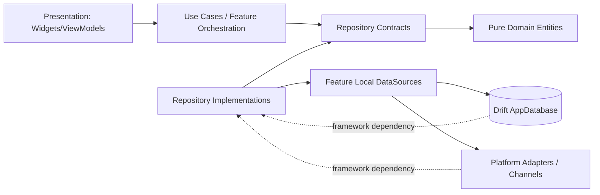
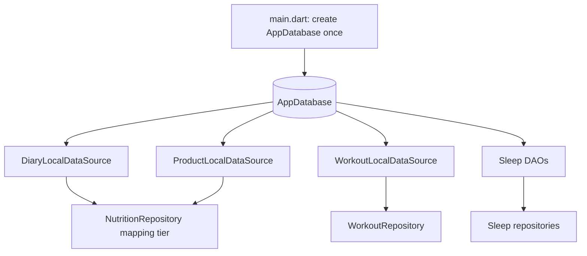
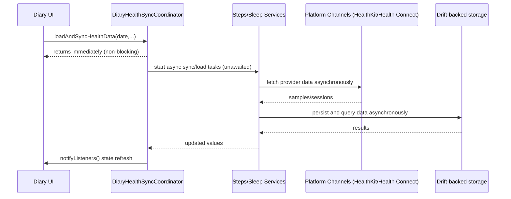
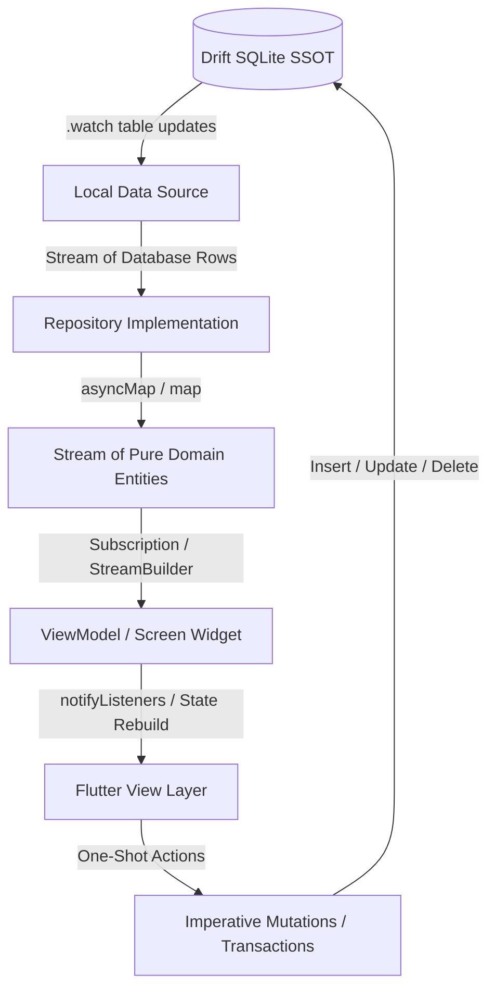

# System Architecture

This document reflects architecture as currently implemented.

## Domain layer purity

The Domain layer is pure Dart and framework-agnostic.

- Domain contracts such as `IDiaryRepository` (`lib/features/diary/domain/repositories/diary_repository.dart`) return pure domain models (`DailyGoal`, `FoodEntry`, `FluidEntry`, `FoodItem`), never Drift row classes.
- `NutritionRepository` (`lib/features/diary/data/nutrition_repository.dart`) is the mapping boundary: it reads row data through local data sources and maps to domain entities before returning to presentation/use-case callers.
- Drift-generated classes remain confined to data source and data implementation boundaries.

## High-level layering

```
Presentation
- lib/features/*/presentation/**
- lib/widgets/**
- lib/dialogs/**

Domain
- lib/features/*/domain/**

Data + Infrastructure
- lib/features/*/data/**
- lib/data/** (AppDatabase + schema/migrations)
- lib/core/infrastructure/**
- lib/services/**
```

## Main app shell

- App entry: `lib/main.dart`
- Initializer: `lib/features/app/presentation/app_initializer_screen.dart`
- Main tab shell: `lib/features/app/presentation/main_screen.dart`
- Sleep route wiring: `SleepNavigation.onGenerateRoute` in `lib/features/sleep/presentation/sleep_navigation.dart`

Main tabs:

1. Diary
2. Workout
3. Statistics
4. Nutrition

## Single database instance lifecycle

- `AppDatabase` is opened once in `lib/main.dart`.
- That instance is propagated through constructor dependency injection to local data sources (for example `DiaryLocalDataSource`, `WorkoutLocalDataSource`, `ProfileLocalDataSource`, `SupplementLocalDataSource`, `ExerciseCatalogLocalDataSource`).
- This single-instance runtime rule prevents multiple concurrent database allocations and reduces risk of deadlocks or transaction corruption.
- `DatabaseHelper` is the low-level initialization manager for database connection setup and migration-hook lifecycle only; feature CRUD is documented via feature-local data sources.

## Feature-local data sources (decentralized)

- `DiaryLocalDataSource` (`lib/features/diary/data/sources/diary_local_data_source.dart`)
- `ProductLocalDataSource` (`lib/features/diary/data/sources/product_local_data_source.dart`)
- `WorkoutLocalDataSource` (`lib/features/workout/data/sources/workout_local_data_source.dart`)
- `Sleep` DAOs under `lib/features/sleep/data/persistence/dao/**`

## Layer and dependency flow



## Data tier architecture



## Async sync-orchestration sequence



## Navigation model

- Most flows use `MaterialPageRoute`.
- Sleep routes are centralized in `SleepNavigation` (`lib/features/sleep/presentation/sleep_navigation.dart`).

## State and Data Flow Model

The application leverages a hybrid **"Reactive Reads / Imperative Writes"** state architecture. Rather than relying on static, manual loading lifecycles or polling, the system establishes the Drift SQLite database as the single absolute **Source of Truth (SSOT)**:



1. **Active Screen Reads (Reactive Streams)**: Active passive-read displays (e.g. daily food logs, supplement tallies, sleep day details, steps aggregations) consume real-time database updates via Drift watched streams (`watchX`). 
2. **Catalog / History Lookups (Future-Based)**: Search screens, point-in-time catalog validations, and heavy, multi-day historical analytical summaries (like PRs or monthly averages) remain strictly imperative (`Future`) to avoid unnecessary aggregation recalculations and CPU lag.
3. **Mutations & Writes (Imperative Futures)**: All insertions, deletions, and updates are one-shot imperative transactions (`Future<void>`). The system relies on database-level table updates to automatically push updated states to subscribers, completely eliminating manual reload calls.

---

## ViewModel Stream Subscription & Teardown Rules

To ensure memory safety and prevent asynchronous data leaks across tab/date transitions, all view models and dynamic components must adhere to strict subscription lifecycles:

1. **Subscription Allocation**: ViewModels track active database streams in private subscription fields (e.g. `StreamSubscription<T>? _subscription`).
2. **Clean Teardown**: Subscriptions must be explicitly cancelled inside the class `dispose()` method:
   ```dart
   @override
   void dispose() {
     _subscription?.cancel();
     super.dispose();
   }
   ```
3. **Date-Switch Recycling Guard**: Whenever a dynamic date or filter switches (e.g. clicking "Next Day" in the Diary, Supplements, or Sleep hubs), the active subscription is synchronously cancelled *before* subscribing to the new target. This guarantees that out-of-order background emissions cannot contaminate the current screen state:
   ```dart
   void setSelectedDate(DateTime date) {
     _selectedDate = date;
     _subscription?.cancel(); // Recycle old subscription immediately
     _subscription = _repository.watchDataForDate(date).listen((data) {
       _state = data;
       notifyListeners();
     });
   }
   ```

---

## Input Focus & Feedback Loop Safety Guards

To protect active user input forms from background stream updates and prevent calculation loops, we enforce two critical boundaries:

1. **Focus Preservation during Editing**: Forms and stateful rows (such as set records in `WorkoutLogDetailScreen` and weight/reps inside `LiveWorkoutScreen`) retain local `TextEditingController` instances.
2. **Edit-Mode Gates**: Active streams must be strictly blocked from rewriting controllers while the user is actively entering text (`_isEditMode == true`). Changes are held in local state, syncing one-way back to the database only on explicit save actions.
3. **Infinite Loop Prevention**: ViewModels and stream listeners must never execute database write operations *as a direct side effect* of receiving a stream emission. All aggregations and modifications must be designed as isolated reads, while normalization updates represent standalone, explicit transactions.

---

## Known implementation notes

- `lib/features/statistics/statistics_state_container.dart` exists but is not wired as shared runtime state.
- Sleep week/month route names currently resolve to `SleepDayOverviewPage` scope switching; standalone week/month page classes also exist.
- **Phase 4 Sleep and Steps Completed**: Passive-read surfaces for sleep NIGHTLY analyses and dynamic steps aggregations are fully reactive.

