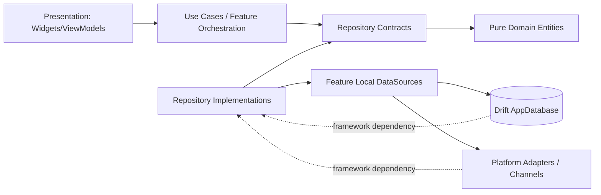
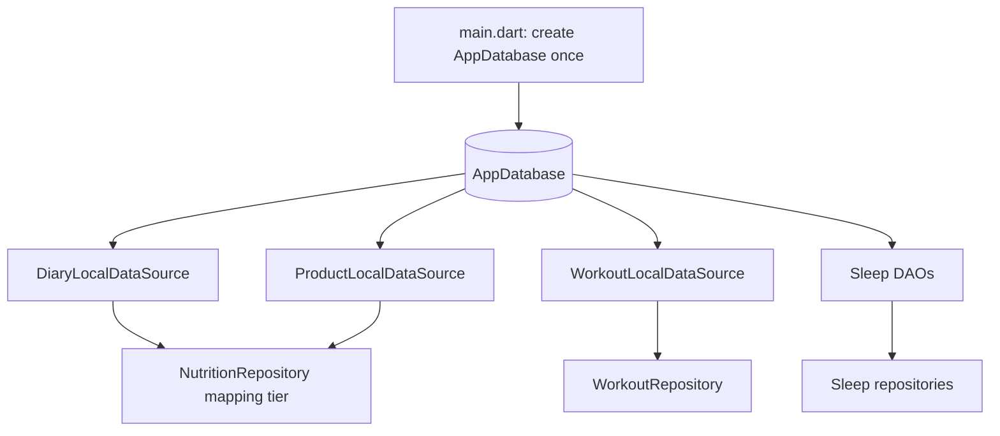
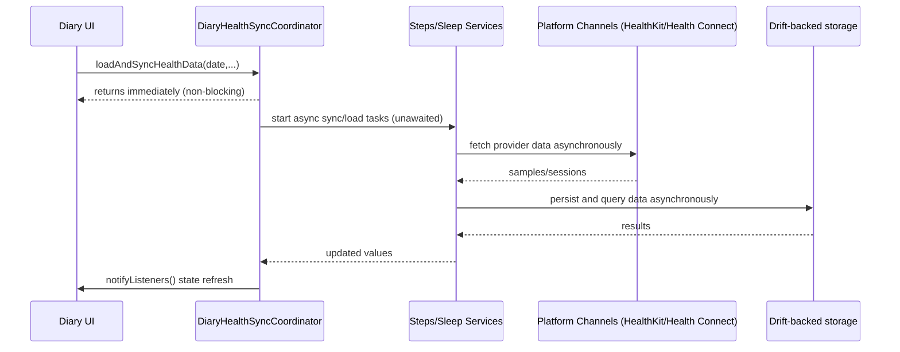

# System Architecture

This document reflects architecture as currently implemented.

## Domain layer purity

The Domain layer is pure Dart and framework-agnostic.

- Domain contracts such as `IDiaryRepository` (`lib/features/diary/domain/repositories/diary_repository.dart`) return pure domain models (`DailyGoal`, `FoodEntry`, `FluidEntry`, `FoodItem`), never Drift row classes.
- `NutritionRepository` (`lib/features/diary/data/nutrition_repository.dart`) is the mapping boundary: it reads row data through local data sources and maps to domain entities before returning to presentation/use-case callers.
- Drift-generated classes remain confined to data source and data implementation boundaries.

## High-level layering

```
Presentation
- lib/features/*/presentation/**
- lib/widgets/**
- lib/dialogs/**

Domain
- lib/features/*/domain/**

Data + Infrastructure
- lib/features/*/data/**
- lib/data/** (AppDatabase + schema/migrations)
- lib/core/infrastructure/**
- lib/services/**
```

## Main app shell

- App entry: `lib/main.dart`
- Initializer: `lib/features/app/presentation/app_initializer_screen.dart`
- Main tab shell: `lib/features/app/presentation/main_screen.dart`
- Sleep route wiring: `SleepNavigation.onGenerateRoute` in `lib/features/sleep/presentation/sleep_navigation.dart`

Main tabs:

1. Diary
2. Workout
3. Statistics
4. Nutrition

## Single database instance lifecycle

- `AppDatabase` is opened once in `lib/main.dart`.
- That instance is propagated through constructor dependency injection to local data sources (for example `DiaryLocalDataSource`, `WorkoutLocalDataSource`, `ProfileLocalDataSource`, `SupplementLocalDataSource`, `ExerciseCatalogLocalDataSource`).
- This single-instance runtime rule prevents multiple concurrent database allocations and reduces risk of deadlocks or transaction corruption.
- `DatabaseHelper` is the low-level initialization manager for database connection setup and migration-hook lifecycle only; feature CRUD is documented via feature-local data sources.

## Feature-local data sources (decentralized)

- `DiaryLocalDataSource` (`lib/features/diary/data/sources/diary_local_data_source.dart`)
- `ProductLocalDataSource` (`lib/features/diary/data/sources/product_local_data_source.dart`)
- `WorkoutLocalDataSource` (`lib/features/workout/data/sources/workout_local_data_source.dart`)
- `Sleep` DAOs under `lib/features/sleep/data/persistence/dao/**`

## Layer and dependency flow



## Data tier architecture



## Async sync-orchestration sequence



## Navigation model

- Most flows use `MaterialPageRoute`.
- Sleep routes are centralized in `SleepNavigation` (`lib/features/sleep/presentation/sleep_navigation.dart`).

## State model

- `Provider` / `ChangeNotifier` for app-level and feature-level state.
- Local `StatefulWidget` state for screen-local concerns.
- `SharedPreferences` for feature toggles and sync metadata.

## Known implementation notes

- `lib/features/statistics/statistics_state_container.dart` exists but is not wired as shared runtime state.
- Sleep week/month route names currently resolve to `SleepDayOverviewPage` scope switching; standalone week/month page classes also exist.
