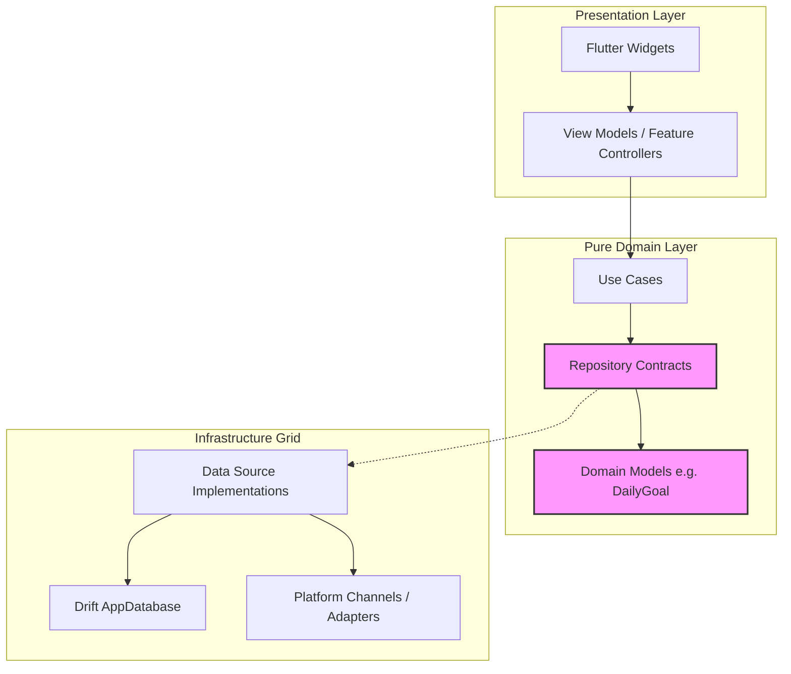
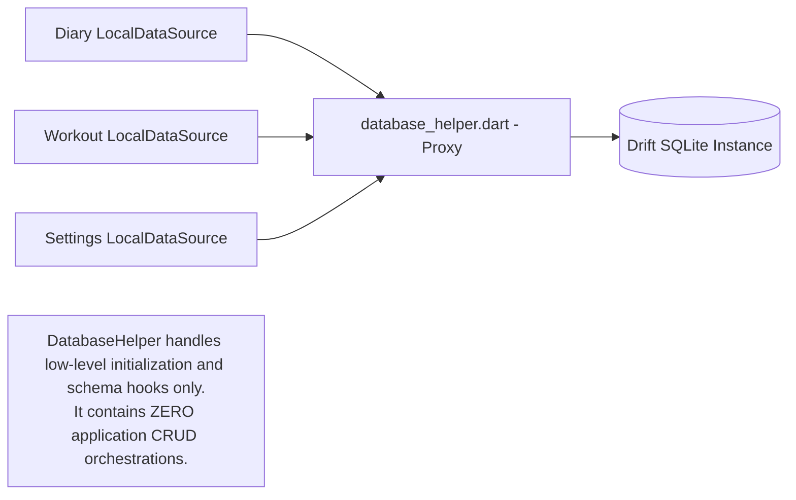
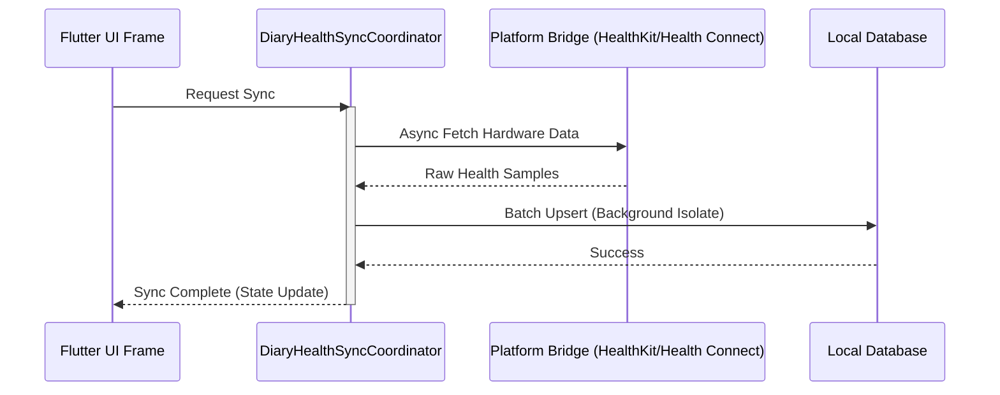

# System Architecture

This document reflects architecture as currently implemented.


## Domain Layer Purity
The Domain Layer is a 100% pure Dart capsule. Concrete repository implementations (e.g., `NutritionRepository` or `DiaryRepository`) act as a strict data mapping tier. They consume raw Drift database row classes (like `DailyGoalsHistoryData`) from local DataSources and map them into pure, framework-agnostic models (like `DailyGoal`) before passing them upward to ViewModels or UseCases. Repository contracts never return Drift or third-party entity classes.

## High-level layering

```
Presentation
- lib/screens/**
- lib/widgets/**
- lib/dialogs/**
- lib/features/*/presentation/**

Feature modules
- lib/features/statistics/**
- lib/features/steps/**
- lib/features/sleep/**

Services and utilities
- lib/services/**
- lib/util/**

Persistence
- lib/data/**
- Drift DB schema + custom SQL migration in lib/data/drift_database.dart
```

## Main app shell

Entry and shell:

- `lib/main.dart`
- `lib/screens/app_initializer_screen.dart`
- `lib/screens/main_screen.dart`

Main tabs currently implemented:

1. Diary
2. Workout
3. Statistics
4. Nutrition

`main.dart` also wires Sleep named routes via:

- `onGenerateRoute: SleepNavigation.onGenerateRoute`

## Feature modules

### Statistics

Path: `lib/features/statistics/`

- `domain/`: range policy, data-quality policy, payload models, domain services
- `data/`: hub/body-nutrition data adapters
- `presentation/`: shared formatter utilities

Hub and drill-down screens live in `lib/screens/statistics_hub_screen.dart` and `lib/screens/analytics/*`.

### Steps

Path: `lib/features/steps/`

- `data/steps_aggregation_repository.dart` (aggregation contracts + health-backed implementation)
- `domain/steps_models.dart`
- `presentation/steps_module_screen.dart`

Platform sync and settings integration are in `lib/services/health/*`.

### Sleep

Path: `lib/features/sleep/`

Sub-areas:

- `platform/`: permissions, adapters, method-channel bridge, sync service
- `data/persistence/`: DAOs + persistence models
- `data/mapping/`: HealthKit/Health Connect canonical mappers
- `data/processing/`: timeline repair + pipeline service
- `data/repository/`: read/query repository contracts
- `domain/`: canonical entities, metrics, scoring, aggregations
- `presentation/`: navigation, day/week/month scope UI, detail pages


## Architectural Flow



## Decentralized Data Access Layer



## Asynchronous Coordination Sequence Flow



## How to Extend This Context

To spawn a new feature block adhering to this pure layer isolation pattern:
1. **Define the Domain:** Create a pure Dart model and a repository contract in `lib/features/<name>/domain/`.
2. **Implement Data Access:** Create a local data source in `lib/features/<name>/data/sources/` that implements the contract, querying the central Drift client via generic methods.
3. **Build Presentation:** Create ViewModels and UI screens in `lib/features/<name>/presentation/` that depend solely on the domain contracts.


## Navigation model

Navigation is currently mixed:

- Most app screens use `MaterialPageRoute` pushes.
- Sleep routes are centralized through named routes in `SleepNavigation` (`lib/features/sleep/presentation/sleep_navigation.dart`).

## State model

Current patterns in use:

- `Provider`/`ChangeNotifier` for app-level services (`ThemeService`, `WorkoutSessionManager`, etc.)
- local `StatefulWidget` state for most screen-level state
- feature-local `ChangeNotifier` for Sleep day VM (`SleepDayViewModel`)
- `SharedPreferences` for feature toggles/sync metadata (Steps/Sleep), AI feature/context toggles (`ai_enabled`, `ai_recommendation_context_enabled`), and adaptive nutrition recommendation state/settings (`adaptive_nutrition_recommendation.*`)

## Persistence model

Primary persistence is Drift-based via `AppDatabase` (`lib/data/drift_database.dart`) with helper/DAO access layers.

Notable current areas:

- workout analytics queries are managed via `WorkoutLocalDataSource` querying the central client.
- nutrition/settings/steps queries are managed via feature-specific LocalDataSources which consume `lib/data/database_helper.dart`.
- Sleep raw/canonical/derived schema and DAOs in `lib/features/sleep/data/persistence/**`

## Known implementation notes

- `lib/features/statistics/statistics_state_container.dart` exists as a structural container but is not currently wired as shared runtime state.
- Sleep week/month route names currently resolve to `SleepDayOverviewPage` with scope switching, while standalone week/month page classes also exist.
