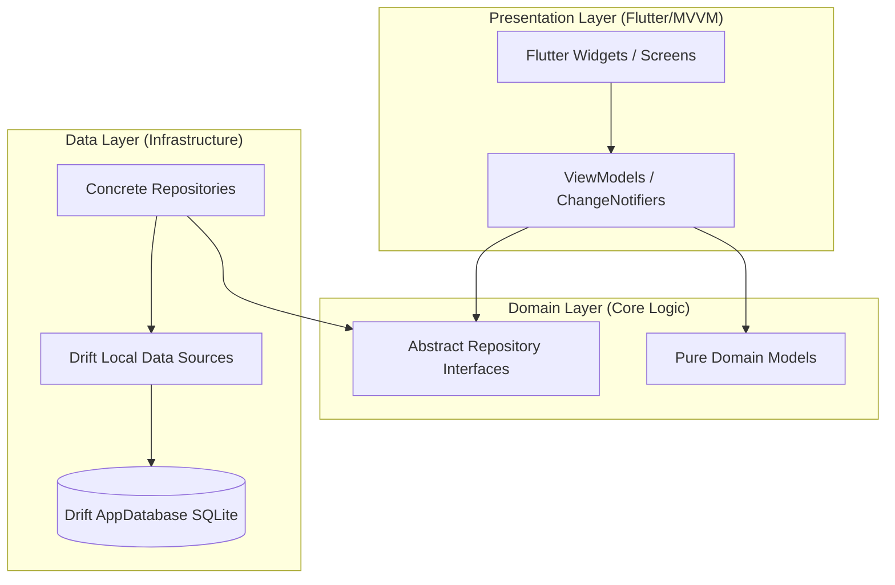

# System Architecture & SQLite Lifecycle

Train Libre strictly adheres to the principles of **Clean Architecture**. This segregation ensures that business logic remains highly testable, independent of the user interface framework, and decoupled from raw persistence mechanisms.

---

## Architectural Layering

The codebase is segregated into three distinct conceptual layers, with dependencies flowing inward toward the Domain layer.



### 1. Presentation Layer (Flutter & MVVM)
*   **Role**: Handles user interaction, layouts, animations, and input collection.
*   **Components**: Flutter screens, custom widgets, and ViewModels (extending `ChangeNotifier`).
*   **Dependency Rule**: ViewModels depend strictly on abstract repository interfaces exposed by the Domain layer. They possess no direct knowledge of Drift queries, file systems, or API endpoints.

### 2. Domain Layer (Inward Layer)
*   **Role**: The absolute heart of the application containing pure, compile-time safe business rules and data representations.
*   **Components**: Pure data models (e.g., `FoodItem`, `FoodEntry`, `MeasurementSession`, `Supplement`) and abstract repository interfaces.
*   **Dependency Rule**: Highly decoupled. It depends on no external packages or architectural layers (Domain does not import Presentation or Data).

### 3. Data Layer (Outward Layer)
*   **Role**: Handles raw database operations, file storage, secure key storage access, and native platform sync adapters.
*   **Components**: Concrete repository implementations (which implement Domain interfaces), specialized Drift Local Data Sources (e.g., `StepsLocalDataSource`, `ProductLocalDataSource`), and the central `DatabaseHelper`.
*   **Dependency Rule**: Translates domain-specific requests into database transactions, queries, or channel calls.

---

## Database Singleton Lifecycle

Persistence in Train Libre is driven by SQLite through the Drift package. To prevent resource contention, transaction lockouts, and memory leaks, the database connection must exist as a strict single instance throughout the application execution lifecycle.

### The DatabaseHelper Singleton
A central mediator `DatabaseHelper` manages this single instance via a lazy private initialization pattern.

```dart
class DatabaseHelper {
  // Singleton private instance
  static final DatabaseHelper instance = DatabaseHelper._init();
  
  // Stored active database connection
  static db.AppDatabase? _driftDb;
  final db.AppDatabase? _injectedDb;

  // Private constructor preventing default instantiation
  DatabaseHelper._init() : _injectedDb = null;
  
  // Test constructor to inject an in-memory mock connection
  DatabaseHelper.forTesting(db.AppDatabase database) : _injectedDb = database;

  // Static setter to override the shared connection directly
  static void setDriftDb(db.AppDatabase database) {
    _driftDb = database;
  }

  // Thread-safe, lazy-initializing getter
  db.AppDatabase get dbInstance =>
      _injectedDb ?? (_driftDb ??= db.AppDatabase());

  Future<db.AppDatabase> get database async => dbInstance;
}
```

### Key Lifecycle Principles

1.  **Lazy Initialization**: The database file `app_hybrid.sqlite` is not opened until the first query is dispatched. This accelerates application startup and avoids redundant resource allocations.
2.  **Thread-Safety**: Because Dart runs on a single-threaded event loop (per Isolate), maintaining a single instance of `dbInstance` guarantees that database operations are serialized naturally. This prevents typical SQLite database lock errors (`SQLITE_BUSY`).
3.  **Dependency Injection in Testing**: The `DatabaseHelper.forTesting()` constructor and `DatabaseHelper.setDriftDb()` allow the testing suite to inject in-memory databases. Tests can therefore execute concurrently without reading or writing to the physical storage on the disk.
4.  **Local Data Source Delegation**: Rather than placing all SQL logic in one giant file, `DatabaseHelper` delegates queries to modular sub-data-sources (e.g., `StepsLocalDataSource.instance`, `DiaryLocalDataSource.instance`) while passing down its centralized `dbInstance` for query resolution.
